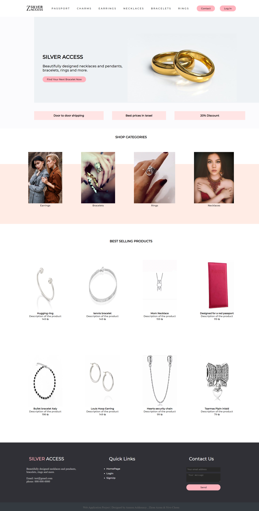

# Silver Access - jewelries and accessories web store 

> [Our project demonstration](https://youtu.be/p7LnCDx70Xc) (in hebrew)

---

### Table of Contents

- [Description](#description)
- [How To Use](#How-To-Use)
- [Author Info](#author-info)
- [Images](#Images)

---

## Description

Web application store we developed during our "web application development" course taught by Igor Rochlin.
In this project we gain a high level of understanding in programing web applications with MVC model and advance our
programing skills with languages like javascript, html/css, razor and C#.

#### Languages

- JavaScript -> jQuery and d3js libraries
- Html / css
- Razor
- C#

[Back To The Top](#Table-of-Contents)

---

## How To Use

#### Installation

- Export git repositorie to visual studio
- In visual studio build the project and open NuGet package manager console
- Run the following command ```Update-Database``` ( if you get an error in this step please delete the entire migration
folder and run ```Enable-Migrations``` following by ```Add-Migration init``` and ```Update-Database``` again)
- Update the database tabels with the queries listed in ```DataBaseQueries``` file 
- Build and run the application


[Back To The Top](#Table-of-Contents)

---

## Authors Info

* **Amnon Ashkenazy** - [LinkedIn](https://www.linkedin.com/in/amnon-ashkenazy-a1590b181/)
* **Zohar Azran** - [LinkedIn](https://www.linkedin.com/in/zohar-azran-8ab6a419a/)
* **Nivo levi** - [GitHub](https://github.com/magnivo11)

[Back To The Top](#Table-of-Contents)

---

## Images
<p align="center">  </p>

[Back To The Top](#Table-of-Contents)

